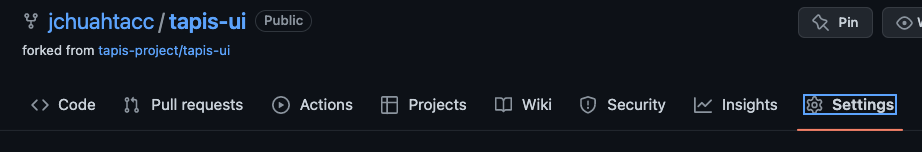
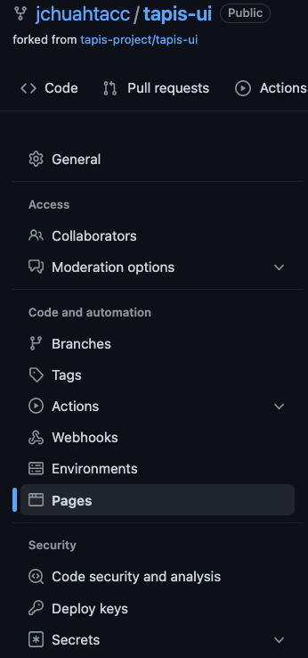
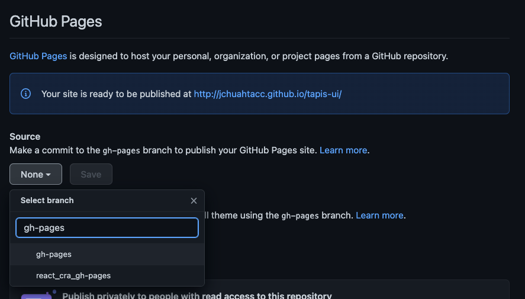
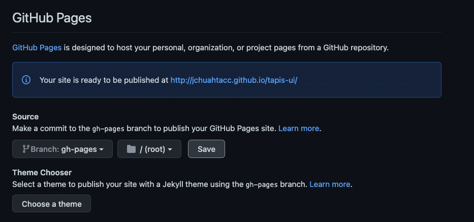
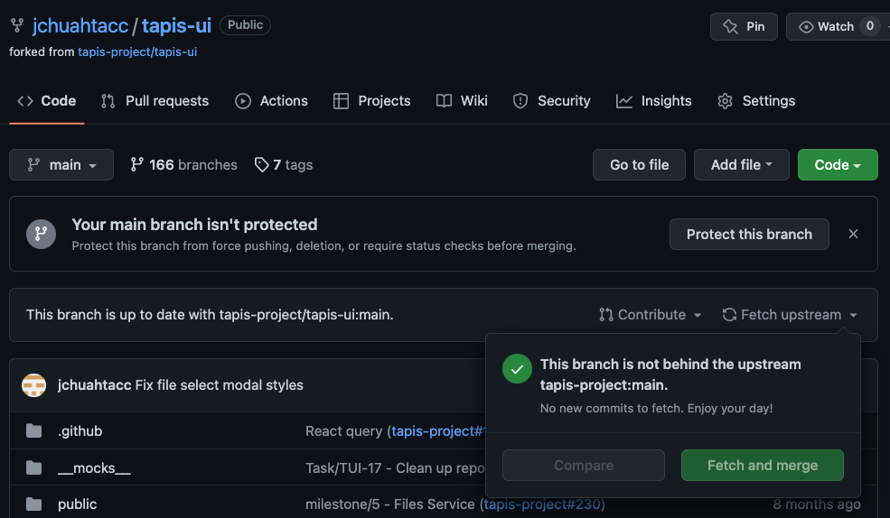

# Deploying Tapis UI

You can deploy your own live copy of Tapis UI. This page will be hosted on GitHub pages and point to the Tapis tenant of your choice. Before beginning, make sure that you have NodeJS installed and a text editor you feel comfortable using.

## Setting up GitHub Pages

In your fork repository of Tapis UI, find the *Settings* option on the horizontal navigation for the repository.



Next, find the *Pages* option in the navigation sidebar.



In the *Source* dropdown, search for the `gh-pages` branch and select it.



Then click the *Save* button.



Note the message that says *Your site is ready to be published at `https://GITHUB_USERNAME.github.io/tapis-ui`. That is the URL of your Tapis UI deployment, and you will need this address in the next step.

## Configuring Your Deployment

You will need to change two files in your Tapis UI fork before publishing the page. You may use any file editor you wish.

First, you will need to configure the `homepage` setting in `package.json`. For convenience, you can see the original line of code [here](https://github.com/tapis-project/tapis-ui/blob/492aac14e863c585e8d0db66e6b9dde1a8c7cf85/package.json#L43). Replace the URL `https://tapis-project.github.io/tapis-ui` with the URL of your GitHub pages site. *Note: Delete the trailing slash in this URL*. The value should be `https://GITHUB_USERNAME.github.io/tapis-ui`. Save the file.

Second, you must change the Tapis tenant URL. Find the `basePath` setting in the file `src/index.tsx`. For convenience, you can see the original line of code [here](https://github.com/tapis-project/tapis-ui/blob/492aac14e863c585e8d0db66e6b9dde1a8c7cf85/src/index.tsx#L11). Currently, it is pointing to the TACC Tapis tenant. For this training, we will point it to the Training Tapis tenant. Replace `https://tacc.tapis.io` with `https://training.tapis.io`. Save the file.

## Committing and Deploying

In a command line shell with NodeJS and `git`, use the following commands:

```bash
eval `ssh-agent`
ssh-add $HOME/.ssh/tapisui
npm install
git add .
git commit -m "Tapis Training"
npm run gh-pages
```

Briefly, the commands will:

- Add your private key to your shell session
- Install any required node packages
- Commit your file changes
- Build and publish your site

Once it has completed, you will be able to browse to the provided GitHub pages URL. 

## Updating Your Deployment

Occasionally, new releases of Tapis UI will add features and fix bugs. You can update your fork by merging these changes, pulling them down to your local development environment and then deploying them. First, on your forked repository page, find the *Fetch Upstream* dropdown and click the *Fetch and Merge* button.



In your local development machine, from within your cloned repository's directory, you may use the following commands:

```bash
eval `ssh-agent`
ssh-add $HOME/.ssh/tapisui
git pull
npm install
npm run gh-pages
```

It may take a few minutes for GitHub pages to reflect your changes.