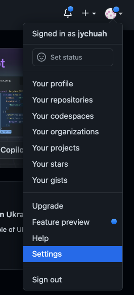
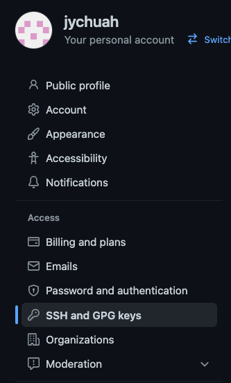
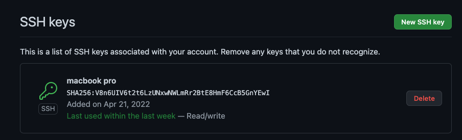
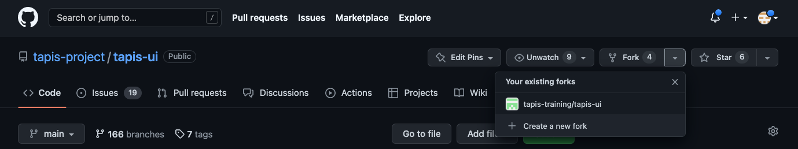
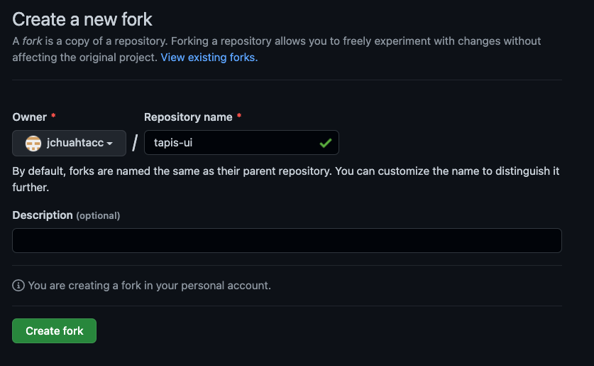
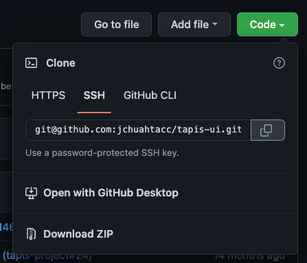

# Setting Up Your Github Account

To deploy a fork of Tapis UI, there are a few steps that are required for preparing your GitHub account. The following instructions assume that you are using a Unix-like command line interface on your development machine with an installation of `git`.

## Creating an SSH Key

In order to publish a live site on GitHub, your local development shell must have a public/private keypair for SSH access to GitHub. First, create a keypair with:

```bash
ssh-keygen -t rsa -b 4096 -f `$HOME/.ssh/tapisui`
```

...where `$HOME` is replaced with your home directory. When prompted for a passphrase, hit ENTER and do not specify a passphrase. This will create two files, a `$HOME/.ssh/tapisui` file with your *private* key and a `$HOME/.ssh/tapisui.pub` file with your *public* key. 
 
## Adding Your SSH Key to GitHub

Next, set up your GitHub account to use the public key you just created. First, log in to [GitHub](https://www.github.com). In the upper right, you will see an icon with your username. Use the dropdown to navigate to your account settings.



In the navigation sidebar on the left side, click on *SSH and GPG Keys*.



At the top of the page content, find the *New SSH Key* button.



In the next page, title the key *Tapis UI* and paste the contents of your public key file `$HOME/.ssh/tapisui.pub` into the key contents. Note that this should be the contents of your *public key* file, which begins with the text `ssh-rsa`. When you have done this, click the *Add SSH Key* button.


## Using your SSH Key

Any time you need to access GitHub from your local development machine's command line interface via SSH, you can use these commands:

```bash
eval `ssh-agent`
ssh-add $HOME/.ssh/tapisui
```

## Forking Tapis UI

You can now create your own fork of `tapis-ui`. Browse to the repository at [https://github.com/tapis-project/tapis-ui](https://github.com/tapis-project/tapis-ui). Here, you will see a *Fork* button with a dropdown arrow in the upper right of the page. Click on the *+ Create a new fork* button.



In the next page, you can rename your copy of the fork or leave the defaults. When you are ready to proceed, click *Create Fork*.



This fork is your copy. Since it is linked the original repository, you can merge any updates from the main Tapis UI repository.

## Cloning your Tapis UI Fork

To clone your Tapis UI Fork, first find the fork's SSH address. Find the *Code* dropdown button. From here, you will be able to copy the SSH address of your fork. *Note: To be able to publish or deploy Tapis UI, you must use SSH to clone the repository*.



On your local development machine's CLI, use the following commands:

```bash
eval `ssh-agent`
ssh-add $HOME/.ssh/tapisui
git clone git@github.com:GITHUB_USERNAME/tapis-ui.git
```

...where the clone remote address is the address of your fork. If everything works, you should now have a copy of the repository in a directory called `tapis-ui`.