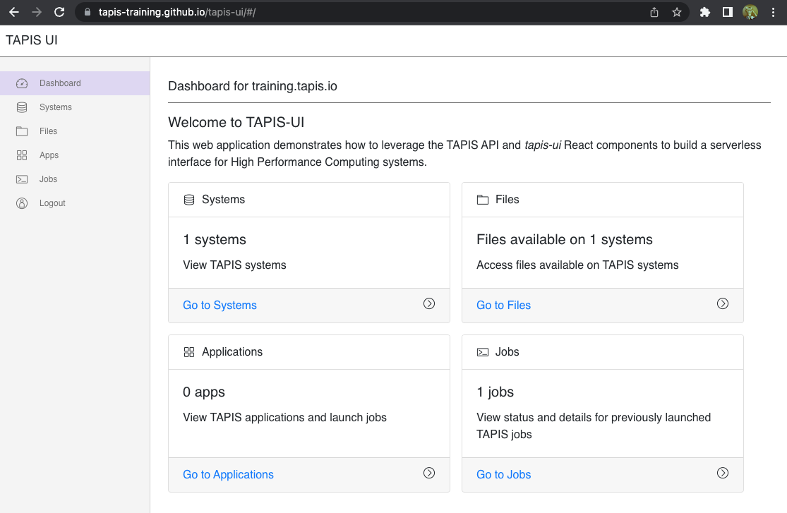
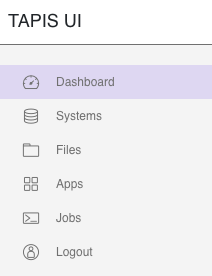
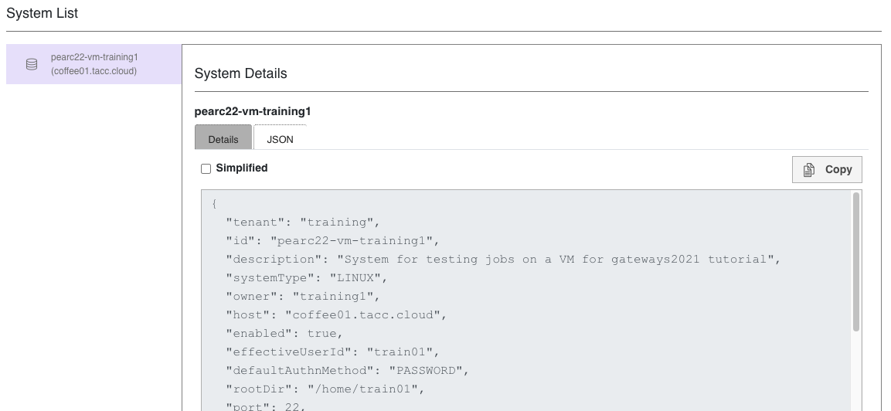
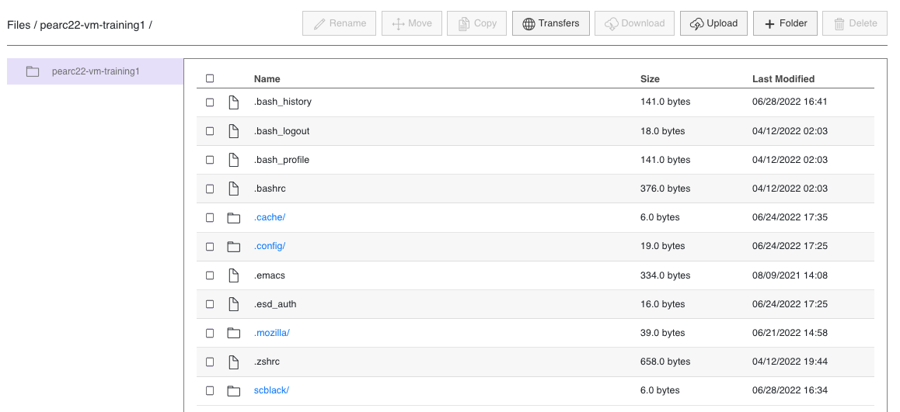
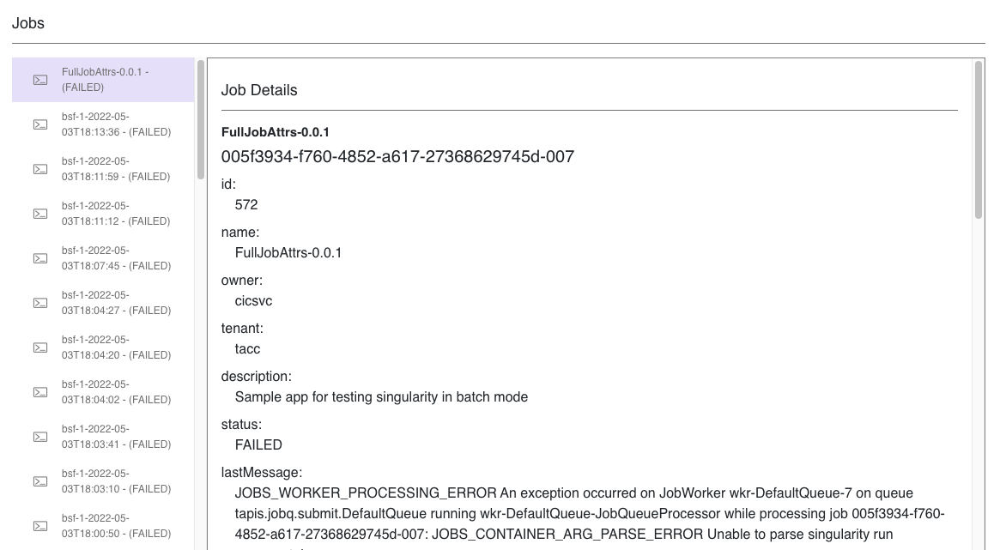

# Tapis UI

Tapis UI is a web interface for Tapis. It is a serverless gateway written in React that can be rapidly configured and deployed to GitHub pages. Once deployed, it provides an interface for accessing files, applications and jobs on your Tapis tenant.

## Try it out

A demonstration site for this training is available at [https://tapis-training.github.io/tapis-ui](https://tapis-training.github.io/tapis-ui). You may log in with your training credentials. This training site uses the `training.tapis.io` tenant, so any accounts, sytems, applications, files and jobs that are available on the tenant will also be available on the demonstration site.

### Navigating in Tapis UI

Upon logging in, you will be taken to a Dashboard with a summary of objects on the Tapis Training tenant that are visible to your account. You may use the shortcuts here to view the relevant Tapis service.

 

The sidebar in Tapis UI provides top level navigation to different Tapis services. Tapis UI is a work in progress. As user interfaces for more services are implemented, this sidebar will grow.

 

### Systems

You may view the definitions of Tapis systems that are available. In addition to providing a visual, web-friendly view of the system definition, you may also view the pre-formatted JSON definition of the system. This pre-formatted JSON can be copied to clipboard, making it easy to re-use the definition with CLI commands.

 

### Files

Tapis UI provides a file interface for browsing, uploading and downloading files on Tapis systems. 

### Apps

With Tapis UI, you can launch a job from an application. Tapis UI simplifies the process by providing a step-by-step wizard with pre-populated defaults from an app definition. The resulting Job definition can be submitted directly to the Jobs service, or the JSON definition can be copied for use with CLI commands.

### Jobs

Tapis UI can display details of Jobs that have been launched on the tenant.

## Deployment Prerequisites 

To build and deploy your own copy of Tapis UI to GitHub pages, you will need the following:

- A [GitHub](https://github.com/) account
- A local installation of [NodeJS](https://nodejs.org/)
- A Unix like environment with `git` and `ssh`

